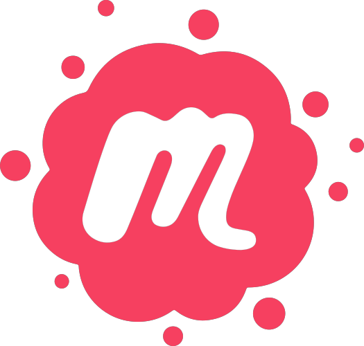
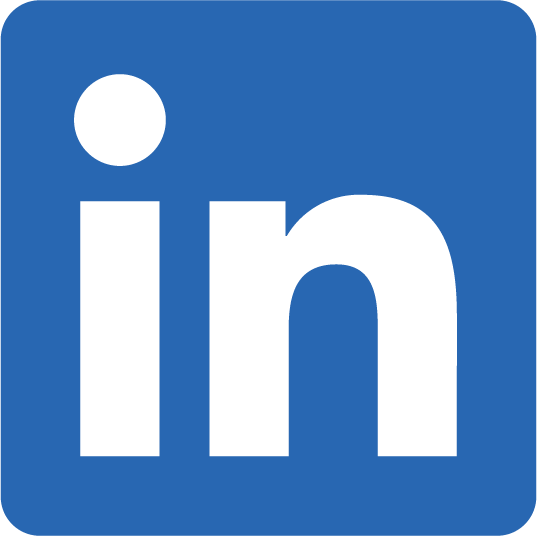

Boston Python is a large and vibrant Python user group in the Boston area. We
run [a number of kinds of events](events.md). Anyone interested in any aspect of the
Python world is welcome!

## 🎯 Next Events

### 🎤 Presentation Night - Python Careers
**📅 Tuesday, July 29th @ 6:00-8:00 PM EDT**
**📍 Microsoft New England Research and Development Center**
**🏢 1 Memorial Drive #1 · Cambridge, MA**
**⏰ RSVP by Monday, July 28 at 10:00 AM**

Co-hosted by Boston Python and PyLadies Boston! Join us for an evening focused on Python careers with three fantastic speakers:

**Navigating the Tech Industry: Embracing Your Unique Path to Success** - Marianne Ray
Learn strategies for thriving in today's challenging tech job market through effective networking, overcoming imposter syndrome, and building authentic professional connections.

**Going All-In: Landing Your First Python Job** - Bill Blanchard
Strategies for landing your first Python development job, especially for those coming from non-traditional backgrounds in today's tightening market.

**Trends in Technical Hiring** - Ben Hicks
Insights from nearly thirty years of work as a technical recruiter.

Pizza will be provided! Doors open at 6:00 PM, talks start at 6:30 PM.

RSVP [here](https://www.meetup.com/bostonpython/events/308729682/?eventOrigin=rsvp_confirmation_suggested_events)

### 🌟 Summer Meetup - Kendall Rooftop Garden
**📅 Wednesday, August 27th @ 6:30 PM**
**📍 Kendall Rooftop Garden**

Thanks to your enthusiastic responses, our casual summer meetup is happening! A relaxed evening to connect with fellow members of the Boston Python community. Whether you're new to Python or a seasoned dev, come hang out, chat, and enjoy the view!

Feel free to bring a friend and spread the word. We're looking forward to seeing you there! 🌅

---

We use [Slack](slack.md) for online discussions.

All of our interactions are covered by our [code of conduct](code-of-conduct.md).

If you are an employer, you can [announce jobs](jobs.md) and even
[sponsor](sponsorship.md) or [host](hosting.md) events.

We appreciate [our sponsors](our_sponsors.md)! Learn more about the organizations
that support us.

## 🤝 Connect With Us

Other ways to connect with Boston Python people:

[{: .left-icon}Meetup](https://www.meetup.com/bostonpython/)

[{: .left-icon}LinkedIn group](https://www.linkedin.com/groups/12301683/)

[{: .left-icon}Slack](slack)

[{: .left-icon}YouTube](https://www.youtube.com/user/bostonpython/videos)

[{: .left-icon}Email the leaders](contact)
