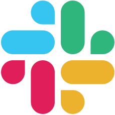

<a href="/merch">&nbsp;&nbsp;&nbsp;&nbsp;&nbsp;&nbsp;&nbsp;<b>Buy a Shirt! »</b>
</a>

Boston Python is a large and vibrant Python user group in the Boston area. We
run [a number of kinds of events](events.md). Anyone interested in any aspect of the
Python world is welcome!

## 🎯 Next Events

### 🌟 [Summer Social - Kendall Rooftop Garden][preznite]

**📅 Wednesday, August 27th @ 6:30 PM**\
**📍 Kendall Rooftop Garden**\
**⏰ [RSVP by Tue, August 26 at 23:59 PM][preznite]**

Thanks to your enthusiastic responses, our casual summer meetup is happening! A relaxed evening to connect with fellow members of the Boston Python community. Whether you're new to Python or a seasoned dev, come hang out, chat, and enjoy the view!

Feel free to bring a friend and spread the word. We're looking forward to seeing you there! 🌅

[preznite]: https://www.meetup.com/bostonpython/events/308729723/

---

## 🤝 Connect With Us

We use [Slack](slack.md) for online discussions.

All of our interactions are covered by our [code of conduct](code-of-conduct.md).

If you are an employer, you can [announce jobs](jobs.md) and even
[sponsor](sponsorship.md) or [host](hosting.md) events.

We appreciate [our sponsors](our_sponsors.md)! Learn more about the organizations
that support us.

Other ways to connect with Boston Python people:

[{: .left-icon}Meetup](https://www.meetup.com/bostonpython/)

[{: .left-icon}LinkedIn group](https://www.linkedin.com/groups/12301683/)

[{: .left-icon}Slack](slack)

[{: .left-icon}YouTube](https://www.youtube.com/user/bostonpython/videos)

[{: .left-icon}Email the leaders](contact)
