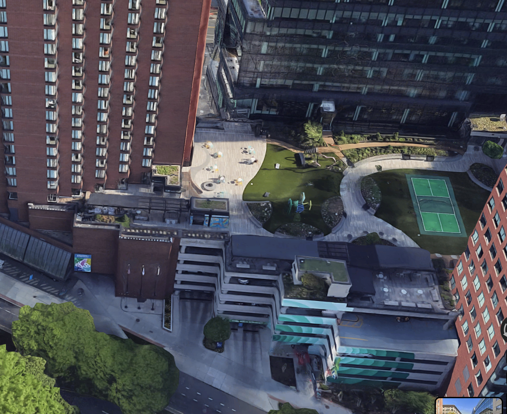
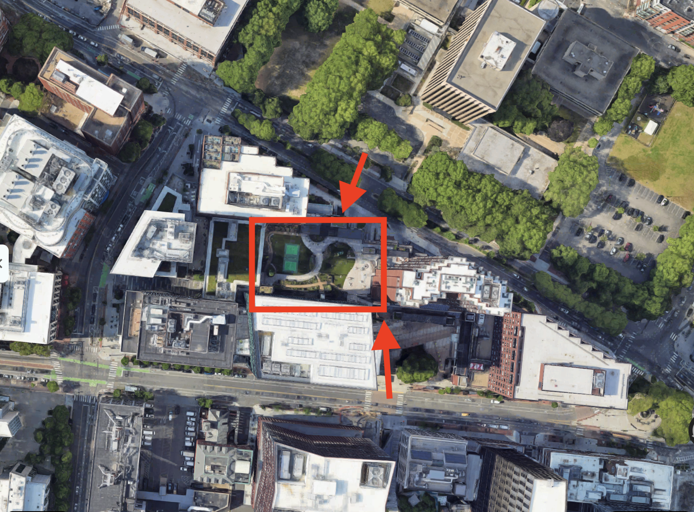
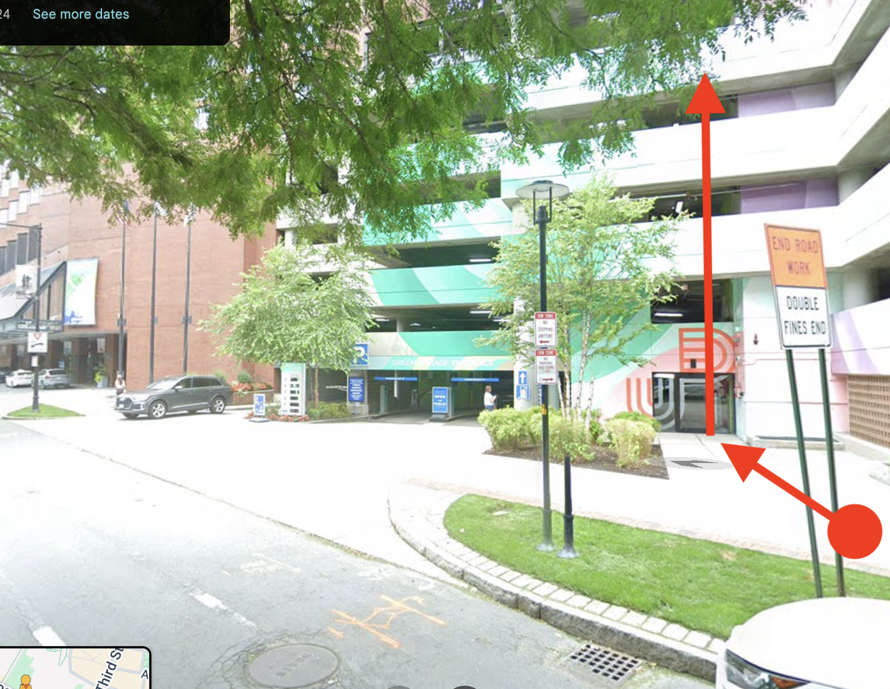
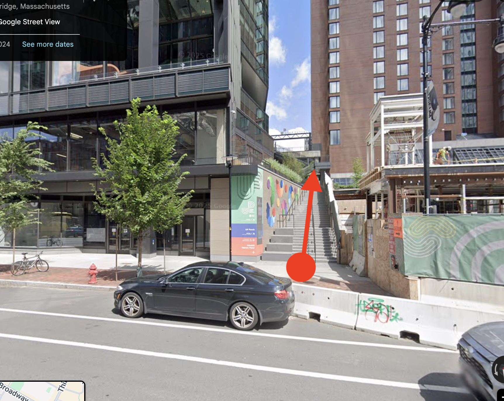

The [Urban Park Roof Garden](https://www.kendallcenter.com/events-public-programs/roof-garden/) is a roof-top public park in Kendall Square above the Red Line T stop.

Clicking any image on this page will take you to a related Google Maps view.

Here is a 3D view of the garden looking to the south, four floors up nestled between the buildings of Kendall Square:

 
Here is a top-down view (north is at the top), showing where the park is between Main St and Broadway:

 
There are two ways to get to the park, neither of them obvious. From Broadway, you can walk into the parking garage at 90 Broadway, to the right of the Marriott. Take the elevator to the top:

 
On Main street, there's a staircase up from the sidewalk, on the north side of the street. It's between Wonder (319 Main St) and the T stop entrance in front of the Marriott:

Both approaches are marked with stylized UP logos, but those might be hard to use as landmarks.
